# Hacking OWASP Juice Shop: IDOR on Order Tracking (Broken Access Control)

**Author:** Megha
**Category:** A01:2021 — Broken Access Control
**Difficulty:** ⭐ Easy–Medium
**Target:** OWASP Juice Shop (`10.49.157.234:3000`, local lab instance)
**Tools:** Firefox, Burp Suite Community Edition, FoxyProxy

---

## Introduction

This write-up documents an **Insecure Direct Object Reference (IDOR)** vulnerability found in Juice Shop's order-tracking endpoint: `GET /rest/track-order/:id`.

The goal was to prove that a **low-privilege customer account** could retrieve another user's **order details** — including a higher-privileged **admin account's** order — simply by changing the order ID in the request, without ever authenticating as that user.

This falls under **A01:2021 — Broken Access Control**, specifically **CWE-639: Authorization Bypass Through User-Controlled Key**.

---

## Step 1: Place an order as the Admin account

Logged in as `admin@juice-sh.op` to generate a legitimate order that belongs to a privileged account.

**Image 1** — Admin login (`admin@juice-sh.op`) <br>
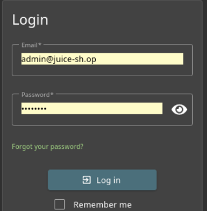
<br>
Added two products to the admin's basket:

**Image 2** — Admin basket: Apple Pomace ×1, Banana Juice (1000ml) ×2 — Total 4.87¤
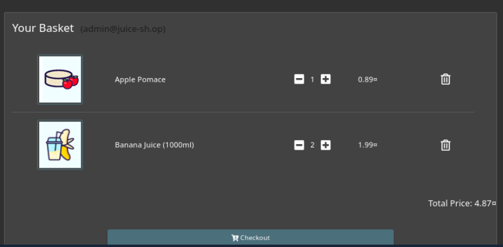

Proceeded through checkout — selected the saved address:

**Image 3** — Select an address (Administrator, 0815 Test Street)
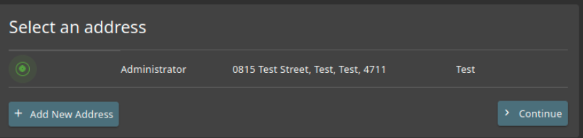

Chose a delivery speed:

**Image 4** — Delivery Address + Choose a delivery speed (One Day Delivery selected)
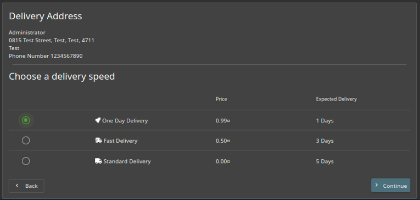

---

## Step 2: Start Burp Suite and enable interception

Before finalizing the order, Burp Suite was launched and FoxyProxy was set to route Firefox traffic through Burp.

**Image 5** — Burp Suite Proxy → Intercept tab, "Intercept is on"
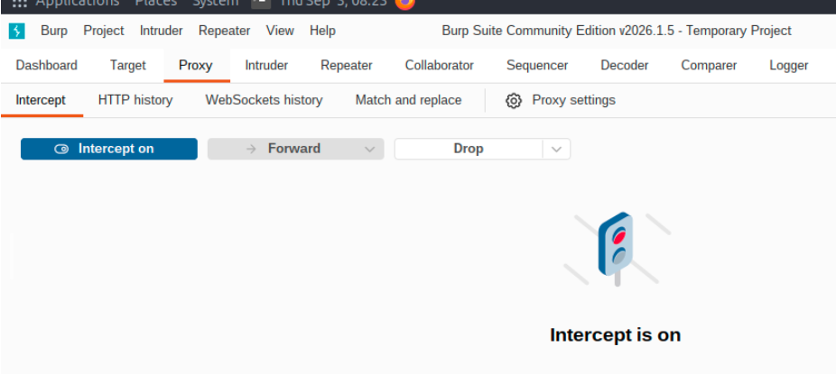

**Image 6** — FoxyProxy extension menu confirming the "Burp" profile is active, order-completion page loaded (`/#/order-completion/5267-973532738bd932e0`)
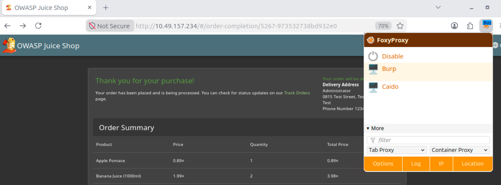

The order confirmation page exposed the order ID directly in the URL:
```
5267-973532738bd932e0
```
This ID was noted as the **target** — an order belonging to the admin account.

---

## Step 3: Place a second order as a low-privilege user

Logged out of the admin account, registered/logged in as a normal customer (`a@test.com` / "Ankita"), and placed a separate order (Apple Juice ×2).

**Image 7** — Order review before payment, logged in as `a@test.com` (Ankita), Total 4.97¤
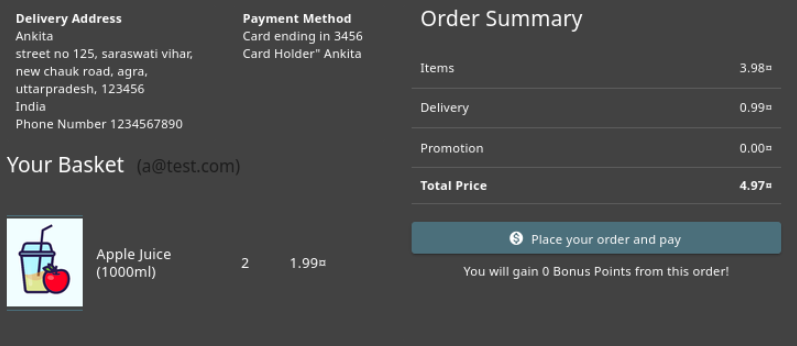

**Image 8** — Order confirmed: "Thank you for your purchase!" — Ankita's own order
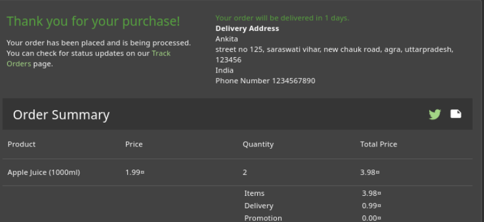

Navigated to **Track Orders** to retrieve this account's own order ID:

**Image 9** — Search Results showing Ankita's own order ID: `506c-fbdd5c9b0bc77597`
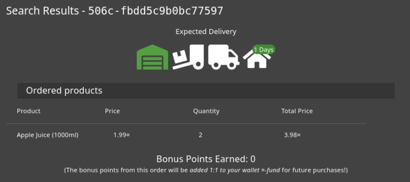

---

## Step 4: Capture the track-order request in Burp Repeater

With Ankita's session still active, the `GET /rest/track-order/:id` request was sent to **Repeater**.

**Image 10** — Raw request in Repeater: `GET /rest/track-order/506c-a865977248e58c2e`, `Authorization: Bearer <Ankita's JWT>` — response returns Ankita's own order data (baseline / control test)
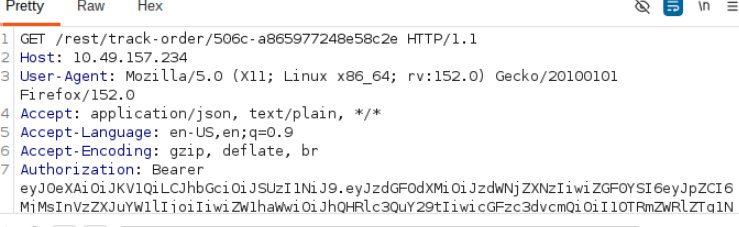

This confirmed the request format and that Ankita's own token correctly retrieves her own order — the expected, authorized behaviour.

---

## Step 5: Swap the order ID — the actual IDOR test

In Repeater, **only the order ID in the URL was changed** — from Ankita's own order ID to the **admin's** order ID (`5267-973532738bd932e0`) captured in Step 2. The `Authorization` header was left untouched — it still carried **Ankita's own JWT token**, not the admin's.

**Image 11** — Modified request: `GET /rest/track-order/5267-973532738bd932e0`, still using Ankita's Bearer token
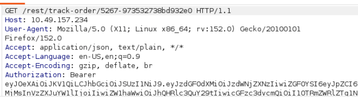

Response received:

```json
HTTP/1.1 200 OK
{
  "status": "success",
  "data": [
    {
      "promotionalAmount": "0",
      "paymentId": "4",
      "addressId": "3",
      "orderId": "5267-973532738bd932e0",
      "delivered": false,
      "email": "*dm*n@j**c*-sh.*p",
      "totalPrice": 5.86,
      "products": [
        { "quantity": 1, "id": 24, "name": "Apple Pomace", "price": 0.89, "total": 0.89, "bonus": 0 },
        { "quantity": 2, "id": 6, "name": "Banana Juice (1000ml)", "price": 1.99, "total": 3.98, "bonus": 0 }
      ],
      "bonus": 0,
      "deliveryPrice": 0.99,
      "eta": "1",
      "_id": "tiARRPS25bhbbtBBZ"
    }
  ]
}
```

**Result:** The admin's full order — products, quantities, prices, `addressId`, `paymentId`, and a partially-masked admin email — was returned to a **standard, unrelated customer account**, using only that customer's own valid session token.

---

## Step 6: Impact analysis

| Aspect | Observation |
|---|---|
| Authentication | Enforced correctly — request was rejected without a valid token |
| Authorization | **Missing** — server never checked that the order belongs to the requesting user |
| Data exposed | Order contents, prices, `addressId`, `paymentId`, partially-masked email |
| Privilege relevant? | Yes — the exposed account here was the **admin** account, showing this is not limited to peer-to-peer (horizontal) access; any known/guessable order ID, including an admin's, is retrievable |
| Attack complexity | Low — only requires a valid (even low-privilege) account and a target order ID |

---

## Root Cause

The `/rest/track-order/:id` endpoint validates that the **request carries a valid JWT** (authentication), but never checks whether the **user identified by that JWT owns the requested order** (authorization). The order ID supplied in the URL is trusted as-is and used directly as a database lookup key.

---

## Remediation

- On every `track-order` lookup, derive the requesting user's identity from the verified JWT (`req.user.id` / `req.user.email`), never from client input.
- Add a server-side ownership check: `WHERE orderId = :id AND userId = req.user.id`, returning `403 Forbidden` (not the record) if they don't match.
- Avoid returning any record fields (even masked ones) when the requester is not the owner — return a generic error instead of a partially-redacted object.
- Reference: [OWASP Cheat Sheet — Authorization](https://cheatsheetseries.owasp.org/cheatsheets/Authorization_Cheat_Sheet.html)

---

## Note on evidence handling

Screenshots 10 and 11 contain live JWT Bearer tokens issued during this lab session. Before publishing this write-up (or the `Evidences/` folder) to a public GitHub repository, **redact/blur the `Authorization: Bearer ...` value** in both images — the tokens themselves are not needed to demonstrate the finding and should not be shared publicly, even from a disposable local lab account.
