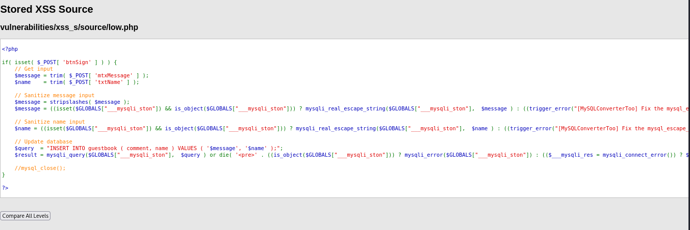
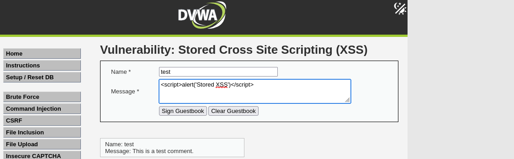
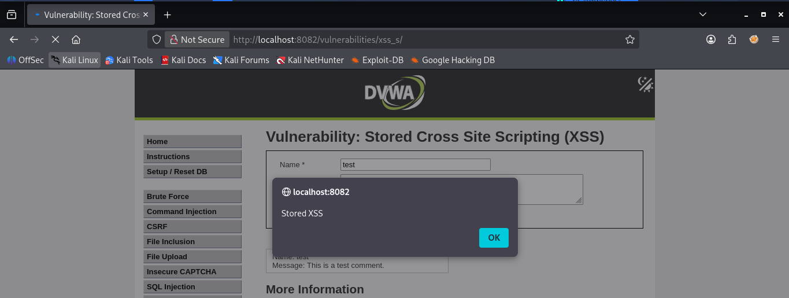
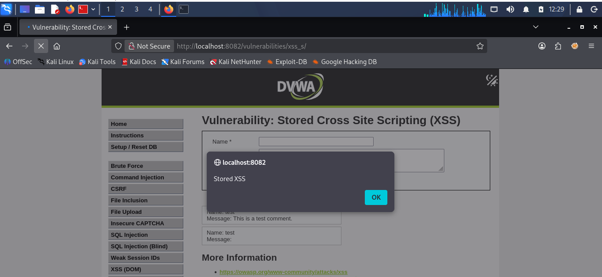

# DVWA — Stored XSS (Low Level)

## Overview

| | |
|---|---|
| **Vulnerability** | Stored Cross-Site Scripting (XSS) |
| **Target application** | DVWA (Damn Vulnerable Web Application) |
| **Module** | XSS (Stored) — Guestbook |
| **Security level** | Low |
| **URL** | `http://localhost:8082/vulnerabilities/xss_s/` |
| **Tools used** | Firefox (no proxy/interception required) |

Stored XSS occurs when user-supplied input is saved on the server (e.g. in a database) and later rendered back to *any* visitor without proper sanitization. Unlike reflected XSS, no social engineering (tricking a victim into clicking a crafted link) is required — the payload fires automatically for every user who views the affected page.

At **Low security level**, DVWA applies no meaningful sanitization to either the `Name` or `Message` fields, making this the simplest possible demonstration of the vulnerability — no filter bypass or proxy tooling needed.

---

## 1. Source code analysis

**File:** `xss_s/source/low.php`

**Evidence 1 — DVWA "View Source" page for XSS (Stored), low level:**



```php
<?php

if( isset( $_POST[ 'btnSign' ] ) ) {
    // Get input
    $message = trim( $_POST[ 'mtxMessage' ] );
    $name    = trim( $_POST[ 'txtName' ] );

    // Sanitize message input
    $message = stripslashes( $message );
    $message = mysqli_real_escape_string( $GLOBALS["___mysqli_ston"], $message );

    // Sanitize name input
    $name = mysqli_real_escape_string( $GLOBALS["___mysqli_ston"], $name );

    // Update database
    $query  = "INSERT INTO guestbook ( comment, name ) VALUES ( '$message', '$name' );";
    $result = mysqli_query( $GLOBALS["___mysqli_ston"], $query );
}
?>
```

### Key observation — no HTML/JS filtering on either field

| Field | Filtering applied | Effective against XSS? |
|---|---|---|
| **Message** | `stripslashes()` (undoes escaping, purely cosmetic) + `mysqli_real_escape_string()` (SQL injection only) | None — no tag stripping, no output encoding |
| **Name** | `mysqli_real_escape_string()` only (SQL injection only) | None — zero HTML/JS filtering |

`mysqli_real_escape_string()` protects against **SQL injection** (it escapes quote characters for safe database insertion) — it does **nothing** to prevent HTML or JavaScript from being stored and rendered. Neither field applies any tag-stripping or output encoding at Low level, making this the simplest possible demonstration of stored XSS: any raw `<script>` payload is stored and rendered exactly as submitted.

---

## 2. Attack plan

1. No bypass technique required — low level has no meaningful blacklist to defeat.
2. Submit a standard `<script>` payload directly through the browser form.
3. Confirm the payload executes immediately on submission.
4. Reload the page to confirm persistence — the defining trait of stored XSS.

---

## 3. Executing the attack

**Evidence 2 — Empty guestbook form before submission:**


**Payload used:**

| Field | Value |
|---|---|
| Name | `test` |
| Message | `<script>alert('Stored XSS')</script>` |

**Evidence 3 — Payload typed into the Message field, ready to submit:**



Click **Sign Guestbook**.

**Evidence 4 — Alert fires immediately on submission**, since the page reloads and displays the guestbook entries — including the newly stored one — right after posting:



---

## 4. Verification — persistence confirmed

Unlike reflected XSS (which requires a victim to click a specifically crafted URL), this payload now lives permanently in the `guestbook` table. **Every visitor** who loads `http://localhost:8082/vulnerabilities/xss_s/` will trigger the alert automatically, with no further interaction, until an administrator manually removes the entry from the database.

**Evidence 5 — Page manually reloaded (browser refresh + re-hit Enter on the URL) and the alert fires again**, with no payload re-submitted — proving the script is executing from stored data, not from the just-completed form post:



---

## 5. Summary of findings

| Check | Result |
|---|---|
| Any HTML/JS-specific filtering on Name field? | ❌ No — only SQL-escaping applied |
| Any HTML/JS-specific filtering on Message field? | ❌ No — only `stripslashes()` (cosmetic) and SQL-escaping applied |
| Output encoded before rendering (`htmlspecialchars()` or equivalent)? | ❌ No — payload stored and rendered completely raw |
| Payload persists across page reloads? | ✅ Yes — confirmed stored in database, fires again on fresh reload |
| Filter bypass technique required? | ❌ No — plain `<script>` payload works unmodified |

## 6. Root cause

No output encoding is applied anywhere in this code path, and neither field has any XSS-aware input handling. `mysqli_real_escape_string()` is a **SQL-injection defense**, frequently and mistakenly assumed to also cover XSS — it does not, since it only escapes characters meaningful to the SQL parser (like quotes), not characters meaningful to the HTML parser (like `<` and `>`). `stripslashes()` on the Message field only reverses PHP's own escaping of quotes/backslashes — it has no relationship to XSS prevention at all.

## 7. Remediation

- Apply context-aware output encoding (`htmlspecialchars()` or equivalent) to **both** fields before rendering them back into HTML.
- Do not rely on `stripslashes()` — it reverses PHP's own quote-escaping and has no effect on HTML/JS injection whatsoever.
- Do not conflate SQL-injection defenses (`mysqli_real_escape_string`) with XSS defenses — they protect against entirely different injection contexts and must both be applied independently, at the correct output boundary (database query vs. HTML response).

---

*Documented as part of DVWA practice — CloudGuardian / KAVACH capstone security learning track.*
